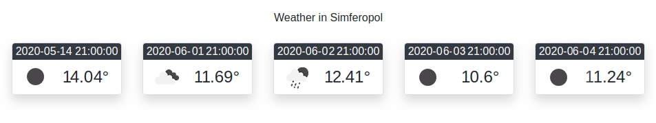

МИНИСТЕРСТВО НАУКИ  И ВЫСШЕГО ОБРАЗОВАНИЯ РОССИЙСКОЙ ФЕДЕРАЦИИ  

Федеральное государственное автономное образовательное учреждение высшего образования  

"КРЫМСКИЙ ФЕДЕРАЛЬНЫЙ УНИВЕРСИТЕТ им. В. И. ВЕРНАДСКОГО"  

ФИЗИКО-ТЕХНИЧЕСКИЙ ИНСТИТУТ  

Кафедра компьютерной инженерии и моделирования
<br/><br/>
### Отчёт по лабораторной работе № 6<br/> по дисциплине "Программирование"
<br/>
​Cтудента 1 курса группы ПИ-б-о-192(1)<br/>
Гусько Елизавета Викторовна<br/>
направления подготовки 09.03.04 "Программная инженерия"  
<br/>


<br/>
<table>

<tr><td>Научный руководитель<br/> старший преподаватель кафедры<br/> компьютерной инженерии и моделирования</td>

<td>(оценка)</td>

<td>Чабанов В.В.</td>

</tr>

</table>

<br/><br/>

​

Симферополь, 2020

<br/>

# Лабораторная работа №6

# Погодный информер

### ***Цель***: 
1. Закрепить навыки разработки многофайловыx приложений;
2. Изучить способы работы с API web-сервиса;
3. Изучить процесс сериализации/десериализации данных.

<br/>

### Ход работы:

1. программный код нашего сервера  с подключением сторонних файлов

 ``` c++
#include <iostream>
#include <string>
#include <fstream>

#include "include/json.hpp"
#include "include/httplib.h"
#include "include/HC.cfg.h"

using json = nlohmann::json;

void replace(std::string& str, const std::string& from, const std::string& to)
{
    size_t start_pos = str.find(from);
    if (start_pos == std::string::npos) {
        return;
    }
    str.replace(start_pos, from.length(), to);
}

void gen_response(const httplib::Request& req, httplib::Response& res)
{
    std::string s;
    httplib::Client cli("api.openweathermap.org", 80);
    auto result = cli.Get("/data/2.5/forecast?id=693805&APPID=285fe41b4a6382809fe82594ad125003&units=metric");
    json j = json::parse(result->body);
    std::cout << j.at("city").at("name") << std::endl;
    int start = j.at("list")[0].at("dt");

    std::ifstream ifs("Weather.html");
    getline(ifs, s, '\0');
    ifs.close();
    replace(s, "{city.name}", j.at("city").at("name"));
    for (auto& el : j.at("list").items())
    {
        if (el.value().at("dt") >= start)
        {
            replace(s, "{list.dt}", el.value().at("dt_txt"));
            replace(s, "{list.weather.icon}", el.value().at("weather")[0].at("icon"));
            replace(s, "{list.main.temp}", to_string(el.value().at("main").at("temp")));
            start += 86400;
        }
    }
    res.set_content(s, "text/html");
}

int main()
{
    std::cout << "SERVER RUN!" << std::endl;
    httplib::Server svr; //Создаём сервер
    svr.Get("/", gen_response);
    svr.listen("localhost", 3000); //localhost 
}
```
<br/>

2. API key 285fe41b4a6382809fe82594ad125003 и с его помощью мы получаем актуальный прогноз погоды. 

3. Получение данных о погоде: <br/>


> рис 1. итог работы

### Вывод: В ходе выполнения лабораторной работы я закрепила навыки работы с GitHUb, научилась работать с сервером и клиентом, изучила процесс сериализации/десериализации данных.
